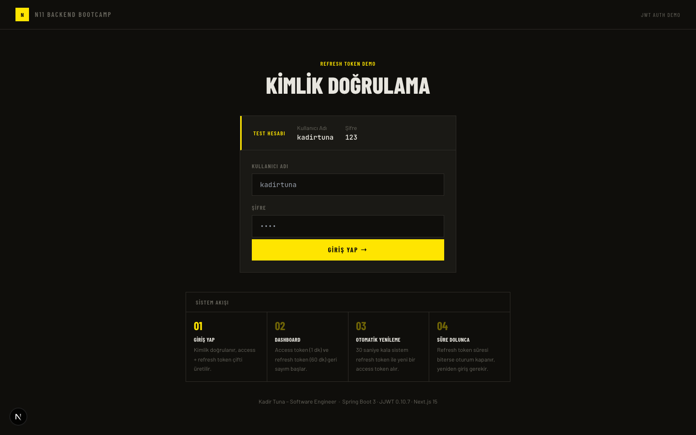
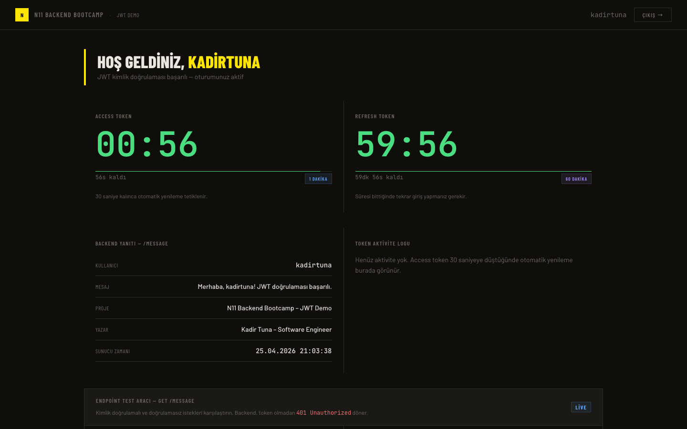
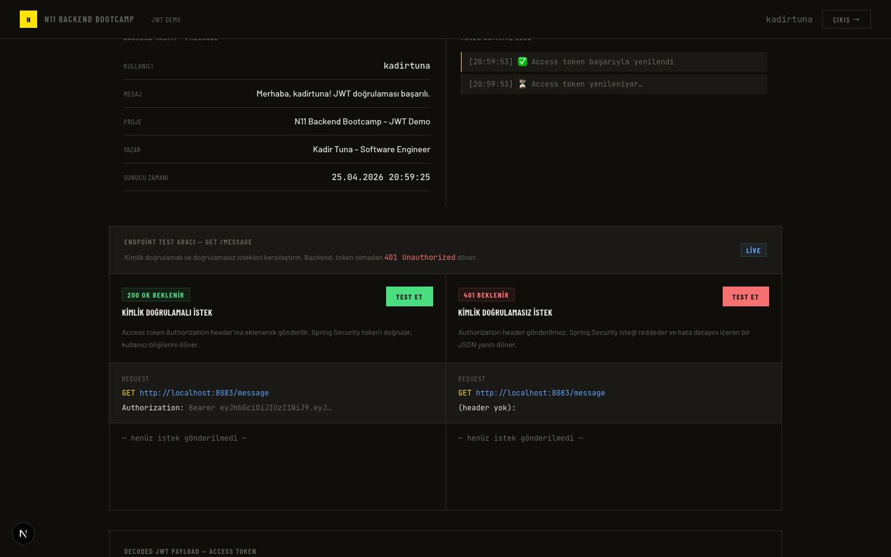
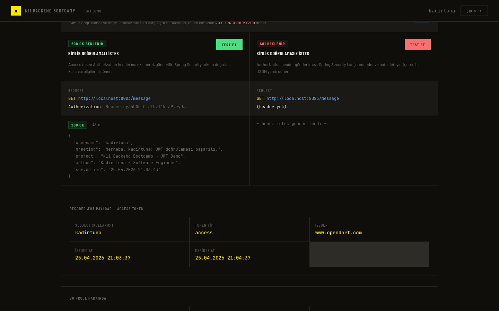
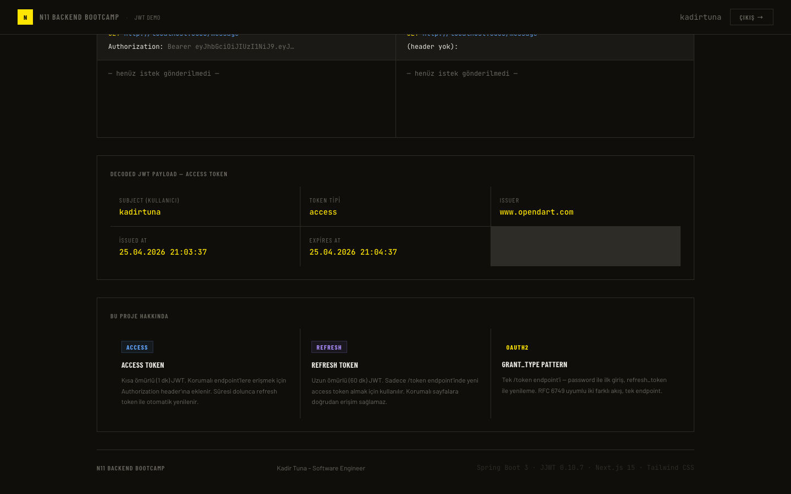

# JWT Authentication Example

Access token + refresh token çiftini, token rotation'ı ve otomatik yenilemeyi gösteren full-stack bir JWT kimlik doğrulama uygulaması. Spring Boot 3 backend ve Next.js 15 frontend'den oluşur.

---

## Tech Stack


---

## Project Structure

```
homework2/
├── backend/    Spring Boot 3 (Port: 8083)
└── frontend/   Next.js 15 App Router (Port: 3000)
```

---

## Architecture

### JWT Flow — Access Token + Refresh Token

Sistemin tamamı iki token üzerine kuruludur:

| Token | Ömür | Amaç |
|---|---|---|
| **Access Token** | 1 dakika | Korumalı endpoint'lere erişim (`Authorization: Bearer ...`) |
| **Refresh Token** | 60 dakika | Süresi dolan access token'ı yenilemek için `/token` endpoint'ine gönderilir |

Her iki token da aynı anahtarla imzalanır; `tokenType` claim'i (`"access"` veya `"refresh"`) token tipini belirler. Bu sayede korumalı endpoint'e refresh token gönderilmesi ya da `/token`'a access token gönderilmesi Spring Security veya `AuthService` katmanında reddedilir.

---

### Why a Refresh Token?

Access token'ı kısa tutmak güvenlik açısından önemlidir: token çalınırsa zararı sınırlı kalır. Ancak kullanıcının her dakika tekrar şifre girmesini istemiyoruz. Refresh token bu ikilemyi çözer:

```
Kullanıcı    Frontend          Backend
   |             |                 |
   |-- login --> |-- POST /token ->|
   |             |   (password)    |-- access (1 dk)  -|
   |             |<--------------- |-- refresh (60 dk)-|
   |             |                 |
   |             | [30s kaldı, otomatik]
   |             |-- POST /token ->|
   |             |   (refresh_tok) |-- yeni access token -|
   |             |<--------------- |-- yeni refresh token-|
```

Frontend, access token'da **30 saniye kaldığında** refresh token kullanarak yeni bir token çifti alır (token rotation). Eski refresh token tek kullanımlık değildir (blacklist yok), ancak hem access hem refresh yenilenir.

---

### OAuth2-style `grant_type` Pattern

Tek bir `/token` endpoint'i iki farklı akışı yönetir; `grant_type` alanına göre dallanır:

```json
// İlk giriş
{ "grant_type": "password", "username": "kadirtuna", "password": "123" }

// Token yenileme
{ "grant_type": "refresh_token", "refresh_token": "<mevcut_refresh_token>" }
```

Her iki akış da aynı `TokenResponse` yapısını döner:

```json
{
  "access_token": "eyJ...",
  "refresh_token": "eyJ...",
  "token_type": "Bearer",
  "expires_in": 60
}
```

Bu yapı RFC 6749 (OAuth2) ile uyumludur.

---

### Spring Security Filter Chain

Her HTTP isteği `JwtTokenFilter`'dan geçer:

```
HTTP Request
    ↓
JwtTokenFilter
    ├── Authorization header var mı?
    │       ├── Yok → SecurityContext boş kalır → 401
    │       └── Var → token'ı parse et
    │               ├── tokenType == "access"?
    │               │       ├── Hayır  → 401 (refresh token bu endpoint'te geçersiz)
    │               │       └── Evet   → tokenValidate()
    │               │               ├── Geçersiz → 401
    │               │               └── Geçerli  → SecurityContext'e kullanıcıyı set et
    └── filterChain.doFilter()
```

`/token` endpoint'i `permitAll()` olduğu için bu filter'dan geçse de Spring Security tarafından engellemez.

---

### Layer Structure

```
controller/   → HTTP katmanı (AuthController, MessageController)
service/      → İş mantığı (AuthService)
auth/         → JWT altyapısı (TokenManager, JwtTokenFilter, UserDetailsService)
config/       → Spring Security konfigürasyonu (WebSecurityConfiguration)
exception/    → Merkezi hata yönetimi (GlobalExceptionHandler)
request/      → DTO giriş (TokenRequest)
response/     → DTO çıkış (TokenResponse, WelcomeResponse, ErrorResponse)
```

---

## Frontend Screenshots

### Login Page

Kullanıcı adı ve şifre ile giriş. Sayfanın altında sistemin dört aşamalı akışı özetlenir.



---

### Dashboard — Token Timers

Giriş sonrası access token (1 dk) ve refresh token (60 dk) için gerçek zamanlı geri sayım. Renk, kalan süreye göre yeşilden sarıya ve kırmızıya döner.



---

### Auto-Refresh — Token Activity Log

Access token'da **30 saniye kalınca** sistem refresh token kullanarak yeni bir token çifti alır. Aktivite logu bu işlemi zaman damgasıyla kaydeder.



---

### API Tester — Authenticated vs. Unauthenticated

Aynı endpoint'e iki farklı istekle karşılaştırmalı test. Sol panel geçerli access token ile `200 OK` alır; sağ panel header olmadan gönderilir ve backend `401 Unauthorized` döner.



---

### JWT Payload Decoder

Access token browser'da decode edilerek `sub`, `tokenType`, `iss`, `iat` ve `exp` claim'leri gösterilir. Kütüphane kullanılmadan saf Base64 + JSON.parse ile gerçeklenir.



---

## Setup & Running

### Requirements

- Java 21+
- Apache Maven 3.9+
- Node.js 18+

### 1. Backend

```bash
cd backend
mvn spring-boot:run
```

Backend `http://localhost:8083` adresinde çalışır.

### 2. Frontend

```bash
cd frontend
npm install
npm run dev
```

Frontend `http://localhost:3000` adresinde çalışır.

### Test Account

| Kullanıcı Adı | Şifre |
|---|---|
| `kadirtuna` | `123` |

---

## API Endpoints

| Method | URL | Açıklama |
|---|---|---|
| `POST` | `/token` | İlk giriş (`grant_type: password`) veya token yenileme (`grant_type: refresh_token`) |
| `GET` | `/message` | Korumalı endpoint — geçerli access token gerektirir |

### Example: Login

```bash
curl -s -X POST http://localhost:8083/token \
  -H "Content-Type: application/json" \
  -d '{"grant_type":"password","username":"kadirtuna","password":"123"}'
```

```json
{
  "access_token": "eyJhbGciOiJIUzI1NiJ9...",
  "refresh_token": "eyJhbGciOiJIUzI1NiJ9...",
  "token_type": "Bearer",
  "expires_in": 60
}
```

### Example: Login with Refresh Token

Access token süresi dolduğunda mevcut refresh token ile yeni bir token çifti alınır:

```bash
curl -s -X POST http://localhost:8083/token \
  -H "Content-Type: application/json" \
  -d '{"grant_type":"refresh_token","refresh_token":"<refresh_token>"}'
```

```json
{
  "access_token": "eyJhbGciOiJIUzI1NiJ9...",
  "refresh_token": "eyJhbGciOiJIUzI1NiJ9...",
  "token_type": "Bearer",
  "expires_in": 60
}
```

Her yenilemede hem access hem refresh token döner (token rotation). Refresh token'ın süresi de dolmuşsa `401` döner ve kullanıcının tekrar `grant_type: password` ile giriş yapması gerekir.

### Example: Protected Endpoint

```bash
curl -s http://localhost:8083/message \
  -H "Authorization: Bearer <access_token>"
```

```json
{
  "username": "kadirtuna",
  "greeting": "Merhaba, kadirtuna! JWT doğrulaması başarılı.",
  "project": "N11 Backend Bootcamp – JWT Demo",
  "author": "Kadir Tuna – Software Engineer",
  "serverTime": "25.04.2026 20:52:50"
}
```

### Example: Expired Token

Token olmadan ya da süresi dolmuş access token ile aynı endpoint'e gidildiğinde:

```json
{
  "status": 401,
  "error": "Unauthorized",
  "message": "Token süresi dolmuş, lütfen refresh token ile yeni bir access token alın",
  "path": "/message",
  "timestamp": "2026-04-25 20:53:11"
}
```

---

## Technologies

- **Backend**: Java 21, Spring Boot 3.5, Spring Security 6, JJWT 0.10.7
- **Frontend**: Next.js 15 (App Router), TypeScript, Tailwind CSS, JetBrains Mono
- **Auth Pattern**: Stateless JWT, Access + Refresh Token Rotation, OAuth2-style grant_type
